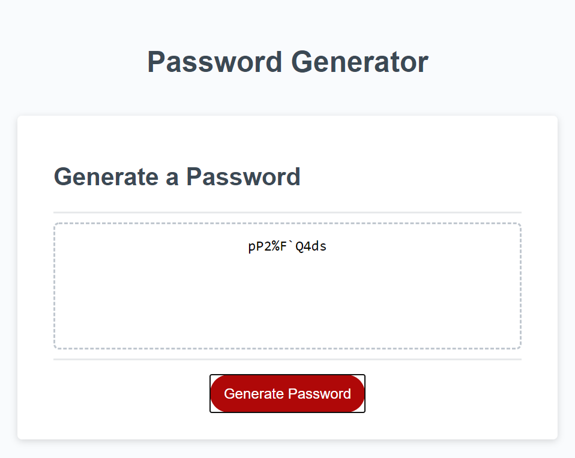

# mas-password-generator

Client request was to create a mini application that will generate a random password between 8 and 128 characters. Users must have a choice to include different elements in their password including lowercase letters, upercase letters, numbers and special characters. Once these choices are made the final password must output onto the screen.

## Instructions

1. The user must click the generate password button.
2. The user will be prompted with a choice of password length. They must choose between 8 and 128 or the program will restart.
3. The user must confirm that they want to use certain classes of characters. lowercase, uppercase, numbers, special characters. If they do not choose any the generator will ask them to start over.
4. Once appropriate choices have been made the program will present a password to the user in the box above the generate password button.
## Built With

* [VSCode](https://code.visualstudio.com/) - Code editing software
* [GitBash](https://gitforwindows.org/) - Command line interface

## Lessons Learned

THis project was chalanging. I wavered between lows of not knowing what to do next to highs of Eureka! I fanally figured it out! This is the first time I've ever gotten a JS to actually do something practical and interact with and HTML document. 

## Authors

* **Mitch Schimmoeller** - *Programmer* - [Schimmoellerm](https://github.com/Schimmoellerm)

## Acknowledgments

* The OSU coding boot camp, its Instructor and TAs who fielded questions regarding this assignment.
* My fellow classmates for providing thoughts and ideas on how to get the JS code working how I needed it to.  